# :edia-edia_rounded: EDIA

## A Unity XR Toolbox for research

!!! note "EDIA provides you with a set of modules (Unity packages) to facilitate the design and conduction of experimental research in XR."
    

## Countdown to launch 🚀

## Key features

-   :simple-instructure:{ .lg .middle } __Structure your experiment__

    ---

    Define the information for your experiment at the granularity level which you need: from sessions to blocks to trials to single steps within trials. EDIA builds upon and extends the functionalities of the [UXF — Unity Experiment Framework](https://github.com/immersivecognition/unity-experiment-framework/){:target="_blank"} (Brookes et al., [2020](https://github.com/immersivecognition/unity-experiment-framework/){:target="_blank"}) package.

    [:octicons-arrow-right-24: Getting started](gettingstarted.md)

-   :material-folder-multiple-plus-outline:{ .lg .middle } __Manage it with config files__

    ---

    Use human readable config files to provide and change central information for your experiment without needing to recompile or touch your Unity code. 

    [:octicons-arrow-right-24: Overview](https://mind-body-emotion.notion.site/Config-Files-1cb03dd4773f8121b74ccd4b6a95ab7c){target="_blank"}

-   :material-eye:{ .lg .middle } __Unified eye tracking integration__

    ---

    EDIA provides an integration of eye tracking for multiple different headsets (HTC Vive, Varjo, Meta Quest Pro, Pico), managing the parsing of the eye tracker output for you in the original sampling rate, and providing it via a standardized interface.

    [:octicons-arrow-right-24: EDIA Eye module](https://mind-body-emotion.notion.site/EDIA-Eye-1e703dd4773f80ea8cfcd75bd87c004b){target="_blank"}

-   :material-remote:{ .lg .middle } __Remotely control mobile XR experiments__

    ---

    Control experiments which run on a mobile XR headset (e.g., Meta Quest) externally and stream what the participant is seeing.

    [:octicons-arrow-right-24: EDIA RCAS](https://mind-body-emotion.notion.site/EDIA-Remote-9dfde97f593e4221bee4630ab3284d4e){target="_blank"}

-   :fontawesome-regular-pen-to-square:{ .lg .middle } __Automatically log relevant data__

    ---

    Use pre-configured tools to log different kinds of data: behavior and movements of the participant, experimental variables, eye tracking data, ...

    [:octicons-arrow-right-24: Getting started](https://mind-body-emotion.notion.site/Logging-the-results-1cb03dd4773f81b196b0f164eb1a67be){target="_blank"}

-   :material-remote:{ .lg .middle } __Synchronize with external data__

    ---

    Use the [LabStreamingLayer protocol](https://labstreaminglayer.org/){:target="_blank"} to synchronize your experiment with other data streams (e.g., EEG, fNIRS, ...).

    [:octicons-arrow-right-24: EDIA LSL](https://mind-body-emotion.notion.site/EDIA-LSL-d0a26b0a043d408dbe353221242296b6){target="_blank"}

## Getting started
Read our [getting started guide](gettingstarted.md).

## Modules

=== ":edia-edia_rounded: EDIA Core"  
    { width=100 align=left }  

    * The 🖤 heart of the EDIA toolbox.
    * Structure your experiment: `Sessions` <> `Blocks` <> `Trials` <> `Trial Steps`
    * Use logically nested Config files (JSON) to manage the compiled experiment.
    * Send messages to the XR user.
    * Experimenter interface.
    

=== ":edia-Edia_Lsl_Yellow: EDIA LSL"  
    { width=100 align=left }  

    1. Use the [LabStreamingLayer](https://labstreaminglayer.org/){:target="_blank"} protocol to synchronize your data.
    2. The :edia-Edia_Lsl_Yellow: `EDIA LSL` module is a convenience wrapper and extension of the [LSL4Unity](https://github.com/labstreaminglayer/LSL4Unity){:target="_blank} package.
    3. It provides prefabs and scripts which allow you to
        2. Send precisely timed triggers with a single command. 
        3. Easily stream data (eye tracking data, movement data) in world or local coordinates.

=== ":edia-Edia_Rcas_Cyan: EDIA RCAS"  
    { width=100 align=left }  

    1. **R**emote **C**ontrol **A**nd **S**treaming.
    2. Interface with your experiment which runs on a mobile headset.
    3. Load Config files from another device.
    4. Send commands to proceed in the experiment.
    5. Stream the headset view to the experimenter's device (*limited).

=== ":edia-Edia_Eye_Orange: EDIA Eye"  
     { width=100 align=left }  

    * Central :eye: eye tracking package of the `EDIA toolbox`.  
    * Provides a unified interface for accessing eye tracking data.  
    * Example visualizations of eye tracking data: gaze, eye openness, ...  
    * Interface for logging eye tracking data via :edia-Edia_Lsl_Yellow:`EDIA LSL` or writing it to disc.

=== ":edia-Edia_Eye_Orange: EDIA Eye Submodules"  
    { width=100 align=left }

    Separate submodules (packages) allow to parse the eye tracking data from the respective device into the unified EDIA eye tracking structure.  
    **Supported headsets:**
    
    

    :fontawesome-brands-meta: Meta Quest Pro
    { .card }

    :brands-vive: HTC Vive Pro Eye
    { .card }

    :brands-varjo_bg: Varjo Aero
    { .card }

    :brands-pico_bg: PICO 4 Enterprise
    { .card }

    

        

## Get involved
If you want to use EDIA or start contributing (as soon as it is openly available), please 
[reach out to us](contact.md).

