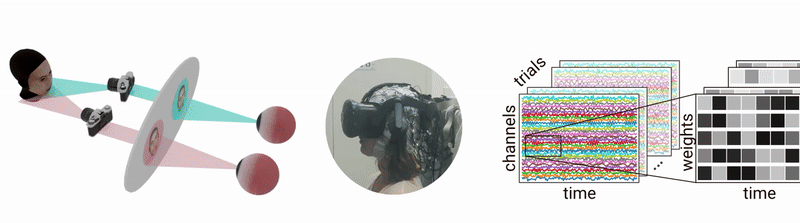
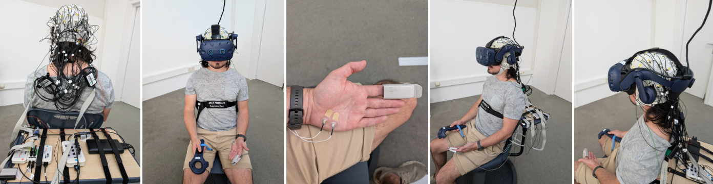

---
hide:
  - navigation
  - toc
---

# Use Cases

Below are example research projects that demonstrate how the EDIA modules can be combined.

## Projects

-   { .usecase-thumb loading=lazy }  
    **EEG decodability of facial expressions and their stereoscopic depth cues in immersive virtual reality**  

    ??? info "Project details"
        **Summary**: The study integrates immersive virtual reality with EEG and eye tracking to examine face perception under controlled stereoscopic depth conditions. Using time-resolved multivariate decoding, EEG signals recorded in fully immersive VR reliably differentiated facial expressions. Stereoscopic depth cues elicit distinct, decodable neural signatures, while expression decoding remains robust across depth conditions, demonstrating the feasibility of multimodal decoding in 3D environments.  
        
        **Time**: 2022–2025  

        **Equipment**  

        - Platform: PC VR
        - Headset: HTC Vive Pro Eye
        - Interaction: HTC Vive Pro Controllers

        **Data modalities**

        - :fontawesome-solid-water: EEG  
        - :fontawesome-solid-eye: eye tracking   
        - :fontawesome-solid-gamepad: subjective reports  

        **EDIA Modules** [version]

        - {{ edia("core", version="pre-release") }}
        - {{ edia("eye", version="pre-release") }}
        - {{ edia("eye_vive", version="pre-release") }}

        **Publications & links** 

        - :fontawesome-solid-newspaper: [Paper [eLife]](https://elifesciences.org/reviewed-preprints/108933v1){:target="_blank"}
        - :fontawesome-brands-github: [GitHub repo](https://github.com/eioe/vr2f/){:target="_blank"}

-   { .usecase-thumb loading=lazy }  
    **AffectTracker: real-time continuous rating of affective experience in immersive virtual reality**

    ??? info "Project details"
        **Summary**: Studying dynamics and physiology of affective states in immersive virtual reality. Emotion elicitation through stereoscopic 360° videos and simultaneous recordings of subjective ratings and multimodal physiological and eye tracking data.  

        **Time**: 2023–ongoing  

        **Equipment**

        - Platform: PC VR
        - Headset: HTC Vive Pro Eye
        - Interaction: HTC Vive Controllers

        **Data modalities**

        - :fontawesome-solid-water: EEG
        - :fontawesome-solid-heart: ECG
        - :fontawesome-solid-lungs: respiration
        - :fontawesome-solid-hand-holding-droplet: skin conductance
        - :fontawesome-solid-eye: eye tracking 
        - :fontawesome-solid-rotate: head tracking 
        - :fontawesome-solid-gamepad: subjective reports 

        **EDIA Modules** [version]

        - {{ edia("core", version="pre-release") }}
        - {{ edia("lsl", version="pre-release") }}
        - {{ edia("eye", version="pre-release") }}
        - {{ edia("eye_vive", version="pre-release") }}

        **Publications & links**

        - :fontawesome-solid-newspaper: [Paper [Front. Virtual Real.]](https://www.frontiersin.org/journals/virtual-reality/articles/10.3389/frvir.2025.1567854/full){:target="_blank"}
        - :fontawesome-brands-github: [GitHub – AffectTracker](https://github.com/afourcade/AffectTracker){:target="_blank"}
        - :material-open-in-new: [Thefirstfloor project page](https://www.behance.net/gallery/208265939/Affective-VR){:target="_blank"}

-   { .usecase-thumb loading=lazy }  
    **Project 3DIL: Revolutionising Eyewitness Identification — The 3D Interactive Lineup**  

    ??? info "Project details"
        **Summary**: The 3D Interactive Lineups (3DIL) project is transforming eyewitness identification through the use of 3D virtual reality (VR). Traditional 2D photo lineups can often lead to mistaken identifications, contributing to wrongful convictions. Our innovative approach uses advanced 3D modeling and neural rendering to create lifelike, interactive facial models, allowing witnesses to view suspects from multiple angles in VR. This project brings together an international team of experts in psychology, computer science, and law enforcement to set a new standard in criminal justice procedures.  

        **Time**: 2024–ongoing 

        **Equipment**

        - Platform: PC VR
        - Headset: Varjo Aero
        - Interaction: HTC Vive Controllers

        **Data modalities**

        - :fontawesome-solid-eye: eye tracking 
        - :fontawesome-solid-gamepad: subjective reports 

        **EDIA Modules**  

        - {{ edia("core", version="pre-release") }}
        - {{ edia("eye", version="pre-release") }}
        - {{ edia("eye_varjo", version="pre-release") }}

        **Publications & links**

        - :material-open-in-new: [Project website](https://www.3dinteractivelineup.com/){:target="_blank"}

-   { .usecase-thumb loading=lazy }  
    **Scientific Eye Tracking Data Quality in immersive Virtual Reality: A Comparison of Tethered and Mobile VR Headsets** 

    ??? info "Project details"
        **Summary**: This study evaluates the eye-tracking performance of five state-of-the-art virtual reality (VR) headsets to assess their suitability for scientific research. Using data from 24 participants, the authors compare three mobile devices (Meta Quest Pro, PICO 4 Enterprise, HTC Vive Focus 3) and two tethered headsets (HTC Vive Pro Eye, Varjo Aero) on key performance metrics: spatial accuracy, precision, and temporal latency. Eye tracking was measured during fixation and saccade tasks performed with and without head movements, and latency was estimated relative to concurrently recorded electrooculography (EOG).

        **Time**: 2025–ongoing  

        **Equipment**

        - Platform:  PC VR  |  mobile VR 
        - Headset:  HTC Vive Pro | Varjo Aero | 
        Meta Quest Pro |  HTC Vive Focus 3 | 
         PICO 4 Enterprise
        - Interaction: Controllers

        **Data modalities**

        - :fontawesome-solid-eye: eye tracking 
        - :fontawesome-solid-arrows-to-eye: EOG 
        - :fontawesome-solid-rotate: head tracking

        **EDIA Modules**

        - {{ edia("core", version="v0.4") }}
        - {{ edia("eye", version="v0.0.1") }}
        - {{ edia("eye_varjo", version="exp-validet") }}
        - {{ edia("eye_vive", version="exp-validet") }}
        - {{ edia("eye_quest", version="exp-validet") }}
        - {{ edia("eye_pico", version="exp-validet") }}
        - {{ edia("eye_focus", version="exp-validet") }}
        - {{ edia("lsl", version="pre-release") }}
        - {{ edia("rcas", version="v0.4.0") }}

        **Publications & links**

        - :fontawesome-solid-person-chalkboard: [Meeting Abstract [VSS 2025]](https://jov.arvojournals.org/article.aspx?articleid=2809682){:target="_blank"}

